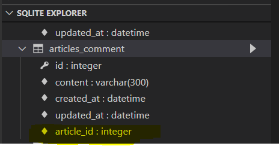
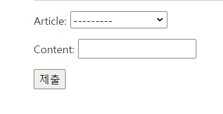
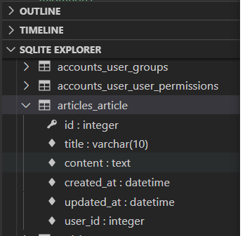

# Django Database

## 관계

### 관계 필드

* 1:N
  * ForeignKey()
  * 추가적인 칼럼이 N쪽에 생겨서 그걸로 조인?
* M:N
  * ManyToManyField()
* 1:1
  * OneToOneField()

### ForeignKey

* 1:N
  * N쪽에 있음
* 다른 테이블 행 식별
* 참조되는 테이블 입장에서는 이 키는 기본키, 참조하는 입장에서는 외래키
* 하나의 테이블이 여러 외래키로 여러 테이블 참조 가능
* 재귀적 외래키
  * 참조하는 테이블과 참조되는 테이블이 같음
* **참조 무결성**
  * 부모 테이블 기본키 아니어도 되지만, 식별 가능해야하기 때문에 유일해야함

* ForeignKey(참조 모델, on_delete)
  * on_delete 설정 **필수**
  * 참조하는 객체 없어지면, 외래키를 가진객체 어떻게 할 것인가?
  * 데이터 정확성, 일관성 유지에 필요(데이터 무결성)
  * CASCADE : 같이 삭제해라
  * PROTECT : 오류 발생해라
  * SET_NULL : NULL로 바꿔라
  * SET_DEFAULT : DEFAULT로 바꿔라
  * SET() : 함수 호출
  * DO_NOTHING : 가만히 있어

### 모델 생성



* 외래키 필드 이름 _ 기본키 이름
  * 웬만하면 단수로 만들어라
* 참조하는 테이블, Article이 비어있으면 오류가 난다.

```python
# 게시물1 만들기
Article.objects.create(title='제목1', content='내용1')
article = Article.objects.get(pk=1)

# 댓글1 만들기
comment = Comment()
comment.content = '댓글1'


# comment.article은 모델에서 생성한 외래키 이름이다.
comment.article = article
comment.save()

comment.pk  # 1
comment.article_id # 1
comment.article.pk # 1

# 댓글2
comment = Comment(content='댓글2', article=article)
comment.save()

comment.pk # 2
comment.article_id # 1, 첫 번째 게시물에 달린 두 번째 댓글
```

* Comment(N)이 Article(1)을 참조
* Article에는 Comment 정보가 없음
  * Article(1)이 Comment(N)을 참조 => 역참조
  * 데이터만 보면 불가능
  * **모델이름_set**
    * `article.comment_set.all()`
    * 모델이름_set

```python
# 역참조
article = Article.objects.get(pk=1)
# 게시물1에 달린 댓글들
article.comment_set.all() # <QuerySet [<Comment: 댓글1>, <Comment: 댓글2>]>
```

* related_name

  * 역참조 _set manager 이름 변경
  * 1:N에서는 거의 안쓰고, N:M일 때에는 사용해야할 때가 있음

  ```python
  class Comment(models.Model):
      article = models.ForeignKey(Article, on_delete=models.CASCADE
                                 related_name='comments')
  ```

  * `article.comments.all()`

### 댓글 생성

```python
from django import forms
from .models import Comment

# detail에 출력
class CommentForm(forms.ModelForm):
    class Meta:
        model = Comment
        fields = '__all__'
```



* 사용자한테 몇 번 게시물에 댓글을 달건지도 받고 있음
  * 이러면 안됨. 댓글만 받도록
  * fields 변경

```python
class CommentForm(forms.ModelForm):
    class Meta:
        model = Comment
        # fields = '__all__'
        exclude = ('article',)
```

```python
@require_POST
def comments_create(request, pk):
    article = get_object_or_404(Article, pk=pk)
    comment_form = CommentForm(request.POST)
    if comment_form.is_valid():
        # commit=False하면 인스턴스는 만들어주는데 DB에는 저장 안함
        comment = comment_form.save(commit=False) 
        comment.article = article
        # comment.article_id = article.pk
        comment.save()
        return redirect('articles:detail', article.pk)
    context = {
        'comment_form': comment_form,
        'article': article,
    }
    return render(request, 'articles/detail.html', context)
```

* 몇 번 게시물에 전달하는지 같이 알려줘야하기 때문에 comment에 담아서 보내줘야함
* `if request.user.is_authenticated:` 추가해서 설정만들 수 있음
  * `return HttpResponse(status=401)` 함께 사용해서 에러 페이지로 보낼 수 있음


### 댓글 삭제

* urls path

```python
path('<int:article_pk>/comments/<int:comment_pk>/delete', views.comments_delete, name='comments_delete'),
```

* 댓글의 pk가 필요하고, 삭제하고 돌아갈 게시물 pk도 필요함

```python
@require_POST
def comments_delete(request, article_pk, comment_pk):
    comment = get_object_or_404(Comment, pk=comment_pk)
    comment.delete()
    return redirect('articles:detail', article_pk)
```

* 삭제하고 다시 게시물로 돌아감
* 댓글 개수
  * `{{ comments|length }}`
  * `{{ article.comment_set.all|length }}`
  * `{{ comments.count}}`
  * 3개 모두 같은 결과, {{}}안에는 메서드라도 ()쓰지 않는다.


## 커스텀 유저 모델

* built-in User model 인증 요구사항이 적합하지 않을 수도
* `AUTH_USER_MODEL` -> custom model 참조
  * 기본 user 모델 오버라이드(재정의)
* 필요한 경우 맞춤 설정 가능
  * 기본 유저 모델보다 좋은 점.
  * 기본 유저 모델 사용도 좋지만, 웬만하면 커스텀으로 만들어놓고 써라
* 그런데 중간에 할 수가 없음
  * 모든 migrations, 첫 migrate 전에 이루어져야함
  * 새 프로젝트 시작할 때, 처음부터 해놔라
  * 이미 해버렸으면 초기화하고 진행
* 기본값
  * auth.User

### abstract

```python
class Info(models.Model):
    name = models.CharField(max_length=20)
    class Meta():
        abstract = True
```

* abstract가 True이면 테이블이 만들어지지 않고, 퍼주는 모델?
  * 기능은 가지고만 있고, 넘겨주기만 함
  * 테이블 없음

### 커스텀 유저 모델 생성

```python
from django.db import models
from django.contrib.auth.models import AbstactUser
# Create your models here.
class User(AbstractUser):
    pass
```

* 이렇게 pass로 해놓고 그냥 나중에 필요할 때 커스텀
  * abstractUser 상속을 받아서 기능은 쓰던 거랑 똑같음. 재정의로 추가기능 쓸 수 있음
  * 플러스 알파 느낌?

```python
# settings.py
# 앱이름.유저모델
AUTH_USER_MODEL = 'accounts.User'
```

* 설정 필요
* 나중에 사용해야함

#### 초기화 후 설정

1. 모든 설계도 삭제
   * migrations 폴더와 init 파일은 지우면 안됨
   * 숫자 붙은 설계도만
2. DBSQLITE3 삭제
3. makemigrations & migrate

### 사용

* 바로 상속받은 기능을 사용하려면 에러 발생
  * `'auth.User' has been swapped for 'accounts.User'`
  * UserCreationFrom 안에 Meta에 있는 User는 auth.User임, accounts.User가 아님
  * 애초에 기본 유저 모델을 참조한 형태로 만들어져 있기 때문에
  * 재정의 해야함(새로 등록)

```python
# accounts의 forms.py
from django.contrib.auth.forms import UserCreationForm
from django.contrib.auth import get_user_model
class CustomUserCreationForm(UserCreationForm):
    
    class Meta:
        # 현재의 유저를 가져오겠다. 대체된 유제모델을 가져오겠다.
        model = get_user_model()
        # 원래 있던 필드 + 추가하고 싶은 필드(유저 모델에 있는 필드를 써야 한다.)
        fileds = UserCreationForm.Meta.fields + ('email',)
```

* get_user_model()
* UserCreationForm.Meta.fields
* 이제 UserCreationForm를 재정의 한 CustomUserCreationForm으로 바꿔서 사용

## 유저 : 게시물(1 : N)

* 지금까지는 게시물 : 댓글(1:N)
* 이제는 게시물이 N이 됨

### **유저 모델 참조 2가지 방법**

1. `settings.AUTH_USER_MODEL`
   * 유저 모델 외래키 or M:N일 때 사용
   * models.py에서 유저 모델 참조할 때
   * 문자열 반환 'accounts.User'
   * models.py에서 get_user_model() 쓰면 accounts가 구동을 안하고 있음(앱 구동 순서에 따라서 달라짐), articles의 User모델을 가져옴
   * 앱 순서 바꿀 생각하지 말고 이 방법을 써라
     * 앱 순서 바꾸면 복잡해진다
2. `get_user_model()`
   * 시용자 모델 참조
   * 현재 활성화(active)된 유저 모델(지정된 커스텀 모델, 없으면 User)을 반환
   * models.py말고 다른 곳에서 유저 모델 참조할 때
   * User 객체 반환

```python
# articles models.py
from django.conf import settings

# Create your models here.
class Article(models.Model):
    user = models.ForeignKey(settings.AUTH_USER_MODEL, on_delete=models.CASCADE)
    title = models.CharField(max_length=10)
    content = models.TextField()
    created_at = models.DateTimeField(auto_now_add=True)
    updated_at = models.DateTimeField(auto_now=True)
```



* user_id로 ForeignKey 생설
  * 필드 이름_ 기본키 이름

```python
# articles views.py
article = form.save(commit=False)
    article.user = request.user
    article.save()
```

* 저장하면서 현재의 user도 넣어서 저장
* 게시물 작성자