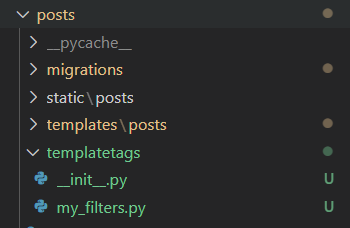

# Django Custom Template

## Custom Template Filter

### 경로 설정

* templategags/
  * __init__.py
  * my_filters.py



### Filter

```python
# my_filters.py
from django import template

register = template.Library()

@register.filter
def hashtag_link(content):
    return f'<a>{content}</a>'
```

* 사용할 곳에서 ``
* 서버 끄고 다시 켜서 사용, 필터 사용 가능

```html
<p class="card-text">{{ post.content|hashtag_link|safe }}</p>
```

* safe 안하면 그냥 문자열로 `<a>content</a>`이렇게 나옴


```python
# my_filters.py
from django import template

register = template.Library()

@register.filter
def hashtag_link(post):
    tags = post.hashtags.all()
    content = post.content
    for tag in tags:
        content = content.replace(tag.content, f'<a href="/posts/hashtags/{tag.pk}">{tag.content}</a>')

    return content
```

* 해시태그를 a태그로 만들어서 같은 해시태그를 달은 모든 게시물을 볼 수 있도록 필터 생성


* replace로 사용해서 이러한 오류 개선 필요

```python
# my_filters.py
from django import template

register = template.Library()

@register.filter
def hashtag_link(post):
    tags = post.hashtags.all()
    content = post.content
    content_list = content.split()
    for tag in tags:
        for i in range(len(content_list)):
            if tag.content == content_list[i]:
                content_list[i] = f'<a href="/posts/hashtags/{tag.pk}">{tag.content}</a>'
    content = ''.join(content_list)
    
    # for tag in tags:
    #     content = content.replace(tag.content, f'<a href="/posts/hashtags/{tag.pk}">{tag.content}</a>')

    return content
```

* 수정
  * 다른 방법의 수정도 필요하다.

sad