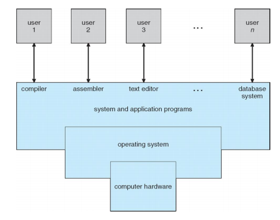

<Operating System Concepts 10th Ed.>(Wiley, 2018)을 학습하고 개인 학습용으로 정리한 내용입니다.

출처 - Siberschatz et. al. <Operating System Concepts 10th Edition>. Wiley. 2018.

# Basic

## Concept

* 컴퓨터 시스템을 운영하는 소프트웨어
* 그렇다면 컴퓨터란?
  * 스마트폰?
  * 정보(information)를 처리하는 기계
* 그렇다면 정보란?
  * 클로드 섀넌이 수학적으로 정의
  * l(x) = -logP(x)
  * l(x) : 사건 x의 정보량, P(x) 사건 x가 일어날 확률
  * **어떠한 불확실성을 측정해서 수치적으로 표현한 것**

### bit

* **b**inary dig**it**
* 정보의 최소 단위
* l(x)가 1이 될 때, 즉 사건이 발생할 확률이 1/2일 때
* 3bit면 표현할 수 있는 사건 8개(2^3)
* 1byte = 8bit, 1MB = 1024bit, 1GB.....
* 정보를 처리하기 위해서 정보의 상태를 변환(0 -> 1, 1 -> 0)
* 부울 대수(Boolean Algebra) : NOT, AND, OR
* **논리 게이트** : NOT, AND, OR, XOR, NAND, NOR
* **논리 회로** : IC, LSI, VLSI, ULSI, SoC, .... 
  * 무어의 법칙
  * 황의 법칙
* 정보의 저장 : 플립-플롭, 전송: 데이터 버스(무선)

### 특성

* 범용성: universality

  * NOT, AND, OR 게이트만으로 모든 계산 가능
  * NAND 게이트만으로 모든 계산 가능
  * 범용 컴퓨터: general-purpose computer
    * 특정 목적을 가지지 않고도 사용

* 계산가능성: computability

* Turing-computable: 튜링 머신으로 계산가능한 것

* Halting Problem: 정지 문제, 튜링 머신으로 풀 수 없는 문제.

* 컴퓨터의 할아버지 : Alan Turing – Turing Machine

  * 헤드와 테이프로 목적을 가지는 튜링 머신을 만들고
  * 튜링 머신 여러 개로 유니버셜 튜링 머신을 만듦, UTM
    * sw에 따라서 hw가 달라짐
  * 튜링 머신 =  응용 프로그램
  * 유니버셜 튜링 머신 = 운영 체제
  * 헤드 = CPU, 테이프 = 메모리
  * 현대적 컴퓨터 모형 설계

* 컴퓨터의 아버지 : John von Neumann(폰 노이만) – ISA: Instruction Set Architecture

  * 내장형 프로그램 방식(stored-program) 처음 도입
    * 메모리(RAM)에 프로그램을 저장
    * 명령어를 통해 Fetch로 RAM에서 가져오고 CPU에서 실행(execute)
    * 이 사이클을 폰 노이만 아키텍처라고 함
    * instruction register

* 그렇다면 프로그램이란?

  * 명령어들의 집합
  * hw가 해야하는 일을 알려줌

* 그렇다면 **운영체제**란?

  * 시스템 서비스를 application program에 전달
  * 중간 매개 역할, user와 app과 hw
  * **process**,  resource, user interface 등 관리
  * HW 전체를 컨트롤

  

## Operating System

* **kernel**이 os의 핵심 역할을 수행
* kernel에서 system programs와 application programs의 인터페이스를 제공

### Modern Computer

* CPU, bus로 연결된 device controllers오 구성
* bootstrap program
  * power를 켰을 때, 처음으로 해야하는 일들
  * ROM에 저장되어 있음
  * HDD에 있는 운영체제(kernel)를 메모리에 로딩해주는 역할

### Interrupts

* I/O devices의 정보를 bus를 통해서 CPU에 알려줌
  * 키보드에서 A를 누르면, 키보드에서 A를 눌렀다고 CPU에 알려줌
* I/O devices와 CPU가 통신하는 방법 중 하나

* HW가 언제가 trigger 가능

### Sotrage System

* 용량과 접근 속도에 따라서 여러 계층으로 나누어짐

1. register - CPU 안에 있음, 가장 빠르고 작음
2. cache
3. main memory(RAM)
4. solid-state disk(ssd) - 메모리 형태의 하드 디스크
5. hard disk(HDD)
6. optical disk
7. magnetic tapes

### I/O Structure

* CPU가 thread of execition을 가지고 있음
* cache를 통해 메모리(RAM)에 access
* I/O device가 interrupt
* device와 device끼리, 즉 device에서 바로 메모리(RAM)에 접근
  * DMA : Direct Memory Access

## Symmetric multiprocessing(SMP)

asdasd